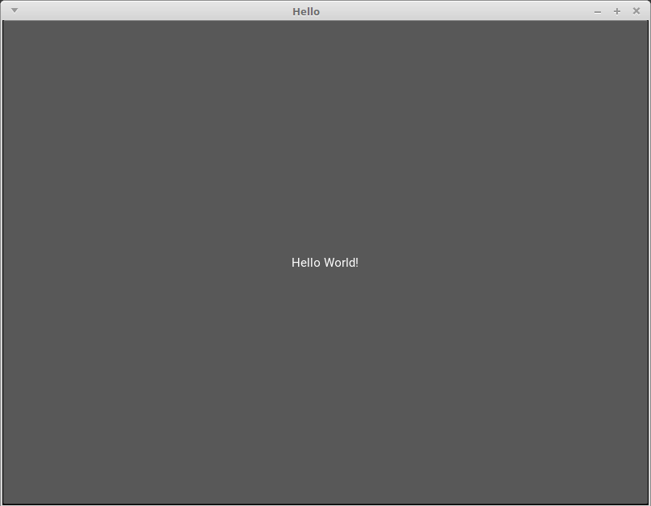

.. _Kivy:

``Kivy`` - ein Toolkit für GUI-Programme
========================================

`Kivy <https://kivy.org/>`__ ist eines von mehreren Toolkits, mit denen sich in
Python Programme mit einer graphischen Bedienoberfläche (Graphical User
Interface, kurz: GUI) programmieren lassen. [#]_ Um Kivy mit Python3 nutzen zu
können, müssen die folgenden Pakete installiert werden:

.. code-block:: sh

    # Aktuelle Paketquellen hinzufügen:
    sudo add-apt-repository ppa:kivy-team/kivy

    # Paketquellen auf mögliche Updates prüfen:
    sudo aptitude update

    # Kivy-Pakete installieren:
    sudo aptitude install cython3 python3-kivy python3-kivy-bin python3-kivy-common

    # Kivy-Beispiele installieren (optional):
    sudo aptitude install kivy-examples

Installiert man auch das Paket ``kivy-examples``, so können im Verzeichnis
``/usr/share/kivy-examples`` einige fertige Beispiel-Programme ausprobiert und
als Vorlage genutzt werden.

.. _Hallo-Welt-Beispiel Kivy:

Ein "Hallo Welt"-Beispiel
-------------------------

Mit Kivy geschriebene Programme haben stets eine ``App``-Klasse, die am
einfachsten mittels :ref:`Vererbung <Vererbung>`  auf der Standard-App-Klasse
aufbauen kann. Diese Standard-Klasse stellt unter anderem eine ``run()``- und
eine ``build()``-Methode bereit, wobei letztere automatisch aufgerufen wird,
wenn das Programm mittels der ``run()``-Methode gestartet wird. Die
``build()``-Funktion wiederum startet automatisch das graphische Bedienfenster,
und kann zugleich weitere Elemente in diesem Fenster platzieren; sie sollte
als Ergebnis stets das "Root"-Widget der Anwendung liefern.

Im einfachsten Fall soll ein schlichter "Button" mittig im Fenster platziert
werden, der die Bezeichnung "Hallo Welt!" trägt. Ein erstes vollständiges
Programm, das wiederum auf ein bereits vordefiniertes Button-Element
zurückgreift, kann damit folgendermaßen aussehen:

.. Creating a kivy application is as simple as:

.. * sub-classing the App class
.. * implementing its build() method so it returns a Widget instance (the root of
  .. your widget tree)
.. * instantiating this class, and calling its run() method.

.. code-block:: python

    # Datei: hello.py

    import kivy
    kivy.require('1.9.0') # Mindest-Version von Kivy

    from kivy.app import App
    from kivy.uix.button import Button

    class HelloApp(App):

        def build(self):
            return Button(text='Hallo Welt!')

    if __name__== "__main__":
        HelloApp().run()

Das ``uix``-Modul stellt allgemeine GUI-Elemte bereit, wie beispielsweise
Widgets und Layouts.

Bei einem Aufruf der Programmdatei wird durch die :ref:`if-main-Abfrage
<ifmain>` eine Instanz der App erzeugt und diese gestartet, wobei wiederum die
``build()``-Funktion aufgerufen wird:

.. code-block:: sh

    python3 hello.py

Damit erscheint folgendes "Anwendungs"-Fenster:

Dieses erste Programm hat keine weitere Funktion; es kann beendet werden, indem
auf das ``X``-Symbol geklickt wird oder in der Shell die Anwendung mittels
``Ctrl c`` unterbrochen wird.

.. _kv-Dateien:
.. _Design-Anpassungen mittels einer ``.kv``-Datei:

.. rubric:: Design-Anpassungen mittels einer ``.kv``-Datei

Das Layout einer Anwendung sollte für eine bessere Übersichtlichkeit,
Anpassungsfähigkeit und Wiederverwertbarkeit von der eigentlichen "Logik" des
Programms getrennt sein ("Model-View-Controller"). Mit Kivy wird dieser
Grundsatz in einer Art und Weise verfolgt, der stark an die Anpassung des
Layouts einer Webseite mittels CSS erinnert: Das Aussehen der einzelnen
graphischen Elemente eines Programms wird über eine entsprechende ``.kv``-Datei
festgelegt werden.

Beim Aufruf der Programm-Datei wird automatisch diejenige ``.kv``-Datei im
gleichen Verzeichnis geladen, deren Namen mit (in Kleinbuchstaben) dem Namen der
App-Klasse übereinstimmt: Hat die App-Klasse beispielsweise den Namen
``HelloWorldApp``, so heißt die zugehörige ``.kv``-Datei ``helloworld.kv``. In
dieser Datei kann mit einer `YAML <https://de.wikipedia.org/wiki/YAML>`_-artigen
Syntax das Design einzelner "Widgets" (Teilbereiche des Hauptfensters) sowie
deren Anordnung festgelegt werden.

... to be continued ...

.. An zwei Stellen sind Python-Ausdrücke innerhalb einer ``.kv``-Datei möglich:
.. Bei einer Zuweisung eines Wertes an eine Property, oder bei der
.. Aktualisierung einer Property via ``on_property``, beispielsweise der
.. ``on_state`` bei einem Push-Button.
.. Wird der Python-Ausdruck in der gleichen Zeile angegeben, so darf er keinen
.. Zeilenumbruch beinhalten und muss stets einen Wert als Ergebnis liefern.
.. Als Alternative dazu kann er mit *genau* einer Einrückungstiefe über mehrere
.. Zeilen angegeben werden (weitere Einrückungstiefen sind nicht erlaubt).

.. Über so genannte "Adapter" können die Widgets wiederum Informationen mit dem
.. Hauptprogramm austauschen.

.. _Links:

.. rubric:: Links

* `Kivy Documentation (pdf, en.) <https://media.readthedocs.org/pdf/kivy/latest/kivy.pdf>`__
* `API Referenz (en.) <https://kivy.org/doc/stable/api-kivy.app.html#kivy.app.App.build>`__
* `Kivy Language (en.) <https://kivy.org/doc/stable/api-kivy.lang.html#module-kivy.lang>`__
* `Kivy Beispiele (en.) <https://kivy.org/doc/stable/gettingstarted/examples.html>`__

.. raw:: html

    

.. only:: html

    .. rubric:: Anmerkungen:

.. [#] Weiter GUI-Toolkits für Python sind das in der Standard-Installation
    enthaltene `Tkinter <https://docs.python.org/3/library/tk.html#index-0>`__,
    sowie PyGTK, PyQT und wxPython (siehe `Übersicht
    <https://docs.python.org/3/library/othergui.html>`__). Kivy ist allerdings
    das einzige in Python selbst geschriebene Toolkit und bietet somit eine sehr
    python-typische Syntax.

